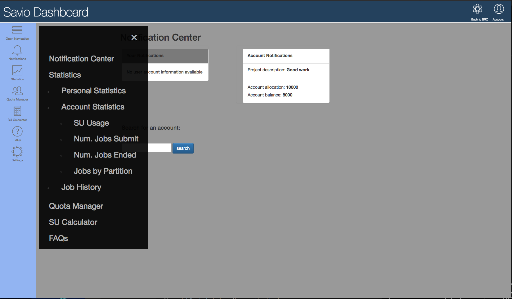
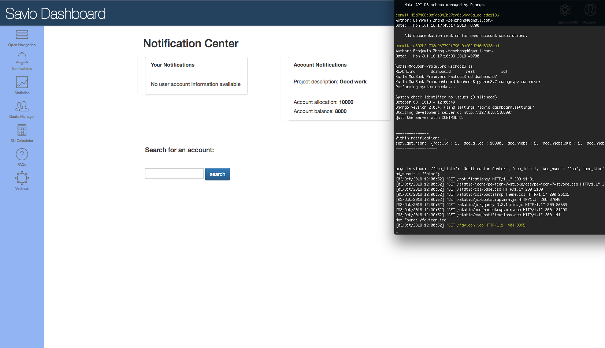

# mybrc

FIXME: fill in better description of this project

Main components include:
	1. Dashboard code
	2. RESTful service to SLURM data in the external Database
	3. SLURM plugin code

## 1. Dashboard 

Contains code for Frontend of Django web app.

## Screenshots of Development

**The left menu bar:**



**Local server running the application:**



#### Set up local configuration 

Install Python requirements for Django web app:

```
    $ pip install -r requirements.txt
```

Creating the local database:

```
    $ python manage,py migrate
```

**Note:** you can generate the requirements file with the help of the [pipreqs](https://github.com/bndr/pipreqs) package (see below).

```
    $ # If desired, install pipreqs
    $ pip install pipreqs
    $ # Generate our requirements file 
    $ pipreqs .
```

#### Run app in local environment 

Initiate development version of application: 

```
    $ python manage.py runserver
```

#### To Do 

- [ ] Put all dependencies, imports, and fns in ABC order
- [ ] Create top-level Python file **dashboard.setup** for envir, deps, and versions
- [ ] Create top-level .in file **dashboard.MANIFEST** to include non-Python files
- [ ] Django-CAS integration for CalNet authentication
- [ ] Create tests for non-auth users attempting to access
- [ ] Create tests for auth users attempting to access
- [ ] Connect app with continuous integration testing via Travis-CI or similar
- [ ] Documentation for all modified or novel functions
- [ ] Containerize application with Docker for mobility
- [ ] Create flags for running as dev or production
- [ ] Label entire app with pure & side effecting functions

## 2. RESTful API + SQL

**rest/** and **sql/** directories contain the code for the RESTful API and the SQL commands that build the database + tables. 

## 3. SLURM plugin 

*To be included...* 
